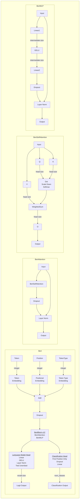

# Week 2 Day 1 - Build Your Own BERT

Today you'll implement your own BERT model such that it can load the weights from the actual BERT and predict some masked tokens.

Reading: [Language Modelling with Transformers](https://docs.google.com/document/d/1XJQT8PJYzvL0CLacctWcT0T5NfL7dwlCiIqRtdTcIqA/edit#)
Reading: [BERT Paper, Section 3.1 "Pre-Training BERT"](https://arxiv.org/pdf/1810.04805.pdf)

Refer to the below schematic for the architecture of BERT. You can ignore the classification head for today - we'll implement that tomorrow.



```python
from dataclasses import dataclass
from typing import List, Optional, Union
import torch as t
import transformers
from einops import rearrange, repeat
from fancy_einsum import einsum
from torch import nn
from torch.nn import functional as F
import utils
import w2d1_test

MAIN = __name__ == "__main__"


@dataclass(frozen=True)
class BertConfig:
    """Constants used throughout the Bert model. Most are self-explanatory.

    intermediate_size is the number of hidden neurons in the MLP (see schematic)
    type_vocab_size is only used for pretraining on "next sentence prediction", which we aren't doing.
    """

    vocab_size: int = 28996
    intermediate_size: int = 3072
    hidden_size: int = 768
    num_layers: int = 12
    num_heads: int = 12
    max_position_embeddings: int = 512
    dropout: float = 0.1
    type_vocab_size: int = 2
    layer_norm_epsilon: float = 1e-12


config = BertConfig()


@dataclass
class BertOutput:
    """The output of your Bert model.

    logits is used for W2D1 and is the prediction for each token in the vocabulary.
    The other fields are used on W2D2 for the sentiment task.
    """

    logits: Optional[t.Tensor] = None
    is_positive: Optional[t.Tensor] = None
    star_rating: Optional[t.Tensor] = None

```

# Batched Self-Attention

We're going to implement a version of self-attention that computes all sequences in a batch at once, and all heads at once. Make sure you understand how single sequence, single head attention works first.


# Attention Pattern Pre-Softmax

Spend at least 5 minutes thinking about how to batch the computation before looking at the spoilers.

<details>

<summary>What should the shape of `project_query` be?</summary>

`project_query` should go from `hidden_size` to `num_heads * self.head_size` which in this case is equal to `hidden_size`. This represents all the heads's Q matrices concatenated together, and one call to it now computes all the queries at once (broadcasting over the leading batch and seq dimensions of the input x).

</details>

<details>

<summary>Should my Linear layers have a bias?</summary>

While these Linear layers are traditionally referred to as projections, in BERT they DO have a bias.

</details>


<details>

<summary>What does the einsum to make the attention pattern look like?</summary>

We need to sum out the head_size and keep the seq_q dimension before the seq_k dimension. For a single batch and single head, it would be: `einsum("seq_q head_size, seq_k head_size -> seq_q seq_k")`. You'll want to do a `rearrange` before your `einsum`.

</details>

<details>

<summary>Which dimension do I softmax over?</summary>

The desired property is that `pattern[batch,head,q]` sums to 1 for all `q`. So the softmax needs to be over the `k` dimension.

</details>

<details>

<summary>I'm still confused about how to batch the computation.</summary>

## Pre Softmax

- Apply Q, K, and V to the input x
- rearrange Q and K to split the `hidden_size` dimension apart into heads and head_size dimensions.
- Einsum Q and K to get a (batch, head, seq_q, seq_k) shape.
- Divide by the square root of the head size.

## Forward

- Softmax over the `k` dimension to obtain attention probs
- rearrange V just like Q and K previously
- einsum V and your attention probs to get the weighted Vs
- rearrange weighted Vs to combine head and head_size and put that at the end
- apply O

</details>

# Attention Forward Function

Your forward should call `attention_pattern_pre_softmax` and then finish the computations using `einsum` and `rearrange` again. Remember to apply the output projection.

```python
class BertSelfAttention(nn.Module):
    def __init__(self, config: BertConfig):
        pass

    def attention_pattern_pre_softmax(self, x: t.Tensor) -> t.Tensor:
        """Return the attention pattern after scaling but before softmax.

        pattern[batch, head, q, k] should be the match between a query at sequence position q and a key at sequence position k.
        """
        pass

    def forward(self, x: t.Tensor) -> t.Tensor:
        pass


if MAIN:
    w2d1_test.test_attention_pattern_pre_softmax(BertSelfAttention)
    w2d1_test.test_attention(BertSelfAttention)

```

# Layer Normalization

Use the ([PyTorch docs](https://pytorch.org/docs/stable/generated/torch.nn.LayerNorm.html)) for Layer Normalization to implement your own version which exactly mimics the official API. Use the biased estimator for Var[x] as shown in the docs.

```python
class LayerNorm(nn.Module):
    def __init__(
        self, normalized_shape: Union[int, tuple, t.Size], eps=1e-05, elementwise_affine=True, device=None, dtype=None
    ):
        pass

    def reset_parameters(self) -> None:
        """Initialize the weight and bias, if applicable."""
        pass

    def forward(self, x: t.Tensor):
        """x and the output should both have shape (N, *)."""
        pass


if MAIN:
    w2d1_test.test_layernorm_mean_1d(LayerNorm)
    w2d1_test.test_layernorm_mean_2d(LayerNorm)
    w2d1_test.test_layernorm_std(LayerNorm)
    w2d1_test.test_layernorm_exact(LayerNorm)
    w2d1_test.test_layernorm_backward(LayerNorm)

```

# Embedding

Implement your version of PyTorch's `nn.Embedding` module. The PyTorch version has some extra options in the constructor, but you don't need to implement those since BERT doesn't use them.

The `Parameter` should be named `weight` and initialized with normally distributed random values.

```python
class Embedding(nn.Module):
    def __init__(self, num_embeddings: int, embedding_dim: int):
        super().__init__()
        pass

    def forward(self, x: t.LongTensor) -> t.Tensor:
        """For each integer in the input, return that row of the embedding.

        Don't convert x to one-hot vectors - this works but is too slow.
        """
        pass


if MAIN:
    w2d1_test.test_embedding(Embedding)

```

# BertMLP

Make the MLP block, following the schematic. Use `nn.Dropout` for the dropout layer.

```python
class BertMLP(nn.Module):
    def __init__(self, config: BertConfig):
        super().__init__()
        pass

    def forward(self, x: t.Tensor) -> t.Tensor:
        pass


if MAIN:
    w2d1_test.test_bert_mlp(BertMLP, dropout=0.5)

```

# Bert Block

Assemble the BertAttention and BertBlock classes following the schematic.

```python
class BertAttention(nn.Module):
    def __init__(self, config: BertConfig):
        super().__init__()
        pass

    def forward(self, x: t.Tensor) -> t.Tensor:
        pass


class BertBlock(nn.Module):
    def __init__(self, config: BertConfig):
        super().__init__()
        pass

    def forward(self, x: t.Tensor) -> t.Tensor:
        pass


if MAIN:
    w2d1_test.test_bert_block(BertBlock)

```

# Putting it All Together

Now fill in the entire Bert module, following the schematic. Tips:

- The language modelling `Linear` after the blocks has shape `(embedding_size, embedding_size)`
- If `token_type_ids` isn't provided to `forward`, make it the same shape as `input_ids` but all zeros.
- The unembedding at the end that takes data from `hidden_size` to `vocab_size` shouldn't be its own Linear layer because it shares the same data as `token_embedding.weight`. Just reuse `token_embedding.weight` and add a bias term.
- Print your model out to see if it resembles the schematic.

```python
class Bert(nn.Module):
    def __init__(self, config: BertConfig):
        super().__init__()
        pass

    def forward(self, input_ids, token_type_ids=None) -> BertOutput:
        pass


if MAIN:
    w2d1_test.test_bert(Bert)

```

# Loading Pretrained Weights

Now copy parameters from the pretrained BERT returned by `utils.load_pretrained_bert()` into your BERT.

This is somewhat tedious, but is representative of real ML work. Race yourself to see if you can do it more quickly than last time!

Remember that the embedding and unembedding weights are tied, so `hf_bert.bert.embeddings.word_embeddings.weight` and `hf_bert.cls.predictions.decoder.weight` should be equal and you should only use one of them.

You can look at the solution if you get frustrated.

<details>

<summary>I'm confused about my Parameter not being a leaf!</summary>

When you copied data from the HuggingFace version, PyTorch tracked the history of the copy operation. This means if you were to call `backward`, it would try to backpropagate through your Parameter back to the HuggingFace version, which is not what we want.

To fix this, you can call `detach()` to make a new tensor that shares storage with the original doesn't have any history.

</details>


```python
def load_pretrained_weights(config: BertConfig) -> Bert:
    hf_bert = utils.load_pretrained_bert()
    pass


if MAIN:
    my_bert = load_pretrained_weights(config)
    for (name, p) in my_bert.named_parameters():
        assert (
            p.is_leaf
        ), "Parameter {name} is not a leaf node, which will cause problems in training. Try adding detach() somewhere."

```

# Tokenization

We're going to use a HuggingFace tokenizer for now to encode text into a sequence of tokens that our model can use. The tokenizer has to match the model - our model was trained with the `bert-base-cased` tokenizer which is case-sensitive. If you tried to use the `bert-base-uncased` tokenizer which is case-insensitive, it wouldn't work at all.

Use `transformers.AutoTokenizer.from_pretrained` to fetch the appropriate tokenizer and try encoding and decoding some text.

## Vocabulary

Check out `tokenizer.vocab` to get an idea of what sorts of strings are assigned to tokens. In WordPiece, tokens represent a whole word unless they start with `##`, which denotes this token is part of a word.

## Special Tokens

Check out `tokenizer.special_tokens_map`. The strings here are mapped to tokens which have special meaning - for example `tokenizer.mask_token` which is the literal string '[MASK]' is converted to `tokenizer.mask_token_id` which is 103.

## Predicting Masked Tokens

Write the `predict` function which takes a string with one or more instances of the substring '[MASK]', runs it through your model, finds the top K predictions and decodes each prediction.

Tips:

- `torch.topk` is useful
- The model should be in evaluation mode for predictions - this disables dropout and makes the predictions deterministic.
- If your model gives different predictions than the HuggingFace section, proceed to the next section on debugging.


```python
def predict(model: Bert, tokenizer, text: str, k=15) -> List[List[str]]:
    """
    Return a list of k strings for each [MASK] in the input.
    """
    pass


if MAIN:
    tokenizer = transformers.AutoTokenizer.from_pretrained("bert-base-cased")
    w2d1_test.test_bert_prediction(predict, my_bert, tokenizer)
    your_text = "The Answer to the Ultimate Question of Life, The Universe, and Everything is [MASK]."
    predictions = predict(my_bert, tokenizer, your_text)
    print("Model predicted: \n", "\n".join(map(str, predictions)))

```

# Model Debugging

If your model works correctly at this point then congratulations, you can skip this section.

The challenge with debugging ML code is that it often silently computes the wrong result instead of erroring out. Some things you can check:

- Do I have any square matrices transposed, so the shapes still match but they do the wrong thing?
- Did I forget to pass any optional arguments, and the wrong default is being used?
- If I `print` my model, do the layers look right?
- Can I add asserts in my code to check assumptions that I've made? In particular, sometimes unintentional broadcasting creates outputs of the wrong shape.

You won't always have a reference implementation, but given that you do, a good technique is to use hooks to collect the inputs and outputs that should be identical, and compare when they start to diverge. This narrows down the number of places where you have to look for the bug.

Read the [documentation](https://pytorch.org/docs/stable/generated/torch.nn.modules.module.register_module_forward_hook.html) for `register_forward_hook` on a `nn.Module` and try logging the input and output of each block on your model and the HuggingFace version.

```python
"TODO: YOUR CODE HERE"

```

Congratulations on finishing the day's content!

Tomorrow you'll have the same partner, so feel free to get started on W2D2. Or, play with your BERT and post your favorite completions in the Slack!
